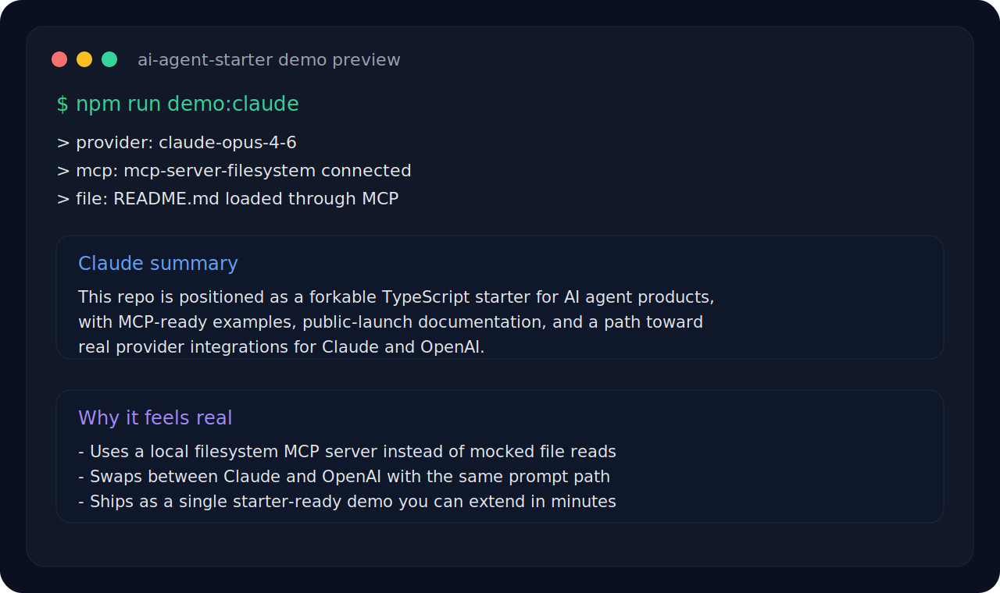

# ai-agent-starter

> The open TypeScript starter for building AI agent products people can actually fork, ship, and extend.

[中文说明](./README.zh-CN.md) · [Examples](./examples/README.md)


If you want a repo that is easy to **understand, demo, fork, and grow into a real AI product**, this is the starting point.

## Why this repo is different

- **README-first but not README-only** — it now includes a real Claude / OpenAI / MCP demo.
- **Small enough to grok fast** — one starter, one runnable example, no framework bloat.
- **Built for public launch** — the docs, demo path, and repo structure are made for discovery and sharing.

## Demo Preview



A minimal CLI demo reads `README.md` through a real filesystem MCP server, then asks either Claude or OpenAI to summarize the repo like a launch reviewer.

## Quick Demo

```bash
cp .env.example .env
npm install
npm run demo:claude
```

Or switch providers:

```bash
npm run demo:openai
```

More details: [`examples/README.md`](./examples/README.md)

## Why this repo exists

Most "AI starter" repos fail in one of two ways:

- they are too toy-like to use in production
- or too bloated to understand in 10 minutes

`ai-agent-starter` aims for the middle:

- simple enough to launch fast
- structured enough to scale
- public-demo friendly
- ready for agents, MCP, prompts, evals, and deployment

## Why people may star it

- **Clear positioning** — not a random demo, but a reusable agent product foundation
- **Fast fork path** — minimal setup, low cognitive load
- **Built for the current AI stack** — Agent workflows, MCP, prompts, evals, deployment
- **Public-launch friendly** — designed to look good on GitHub from day one

## What you get in v0.2

- TypeScript-first project skeleton
- Minimal runnable starter entrypoint
- A real `Claude / OpenAI / MCP` CLI example
- Starter folders for examples and templates
- README structure optimized for public discovery
- A clean base for adding:
  - model providers
  - MCP integrations
  - prompt libraries
  - evaluation flows
  - deployment targets

## Project structure

```txt
ai-agent-starter/
├─ assets/
│  └─ demo-preview.svg
├─ examples/
│  ├─ README.md
│  └─ claude-openai-mcp.ts
├─ src/
│  └─ index.ts
├─ templates/
├─ .env.example
├─ .gitignore
├─ package.json
├─ tsconfig.json
├─ README.md
└─ README.zh-CN.md
```

## Quick start

```bash
git clone https://github.com/ue12233/ai-agent-starter.git
cd ai-agent-starter
npm install
npm run dev
```

Build for production:

```bash
npm run build
npm start
```

## Tech stack

- TypeScript
- Node.js
- tsx
- Anthropic SDK
- OpenAI SDK
- Model Context Protocol (filesystem demo)

## Who this is for

- indie hackers building AI tools
- developers launching agent products
- teams prototyping internal copilots
- creators who want a public AI repo with real growth potential

## What this demo proves

- this repo can call a real MCP server instead of mocking filesystem access
- this repo can switch between Claude and OpenAI with the same high-level flow
- this starter is small, but already useful enough to extend into something real

## Roadmap

### Near term

- [ ] add provider adapters for Claude / OpenAI style APIs
- [x] add MCP integration example
- [ ] add prompt organization pattern
- [ ] add eval workflow example
- [ ] add deploy guide for Vercel / server runtime

### Longer term

- [ ] agent memory patterns
- [ ] tracing / logging defaults
- [ ] multi-agent workflow examples
- [ ] benchmark and demo datasets
- [ ] starter templates by use case

## Growth strategy

If your goal is to turn this into a high-star repo, prioritize this order:

1. excellent README
2. one killer demo GIF/video
3. one real end-to-end example
4. great issue labels and contribution path
5. regular visible updates

## Contributing

PRs and ideas are welcome.

Good first contributions:

- new examples
- MCP integrations
- provider adapters
- better eval templates
- launch/demo improvements

## License

MIT
